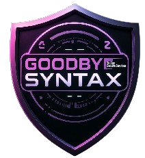

  

# GoodByeSyntax:
GoodByeSyntax is a module that adds functions to **python** and simplifies the existing ones...

## Guide:
Click [GUIDE](GUIDE.md) to see it.

## Install command:
pip install GoodByeSyntax

## PyPI:
[GoodByeSyntax PyPI](https://pypi.org/project/GoodByeSyntax/)

## License:
This project is licensed under the [Private Use License](LICENSE.md).

## My YouTube channel:
[GoodByeSyntax](https://www.youtube.com/@GBS.official0)

**For the exe files, you can check ByteLightProject.**

  <h1>Welcome to GoodByeSyntax</h1>
  
GoodByeSyntax is a module that adds functions to **python** and simplifies the existing ones...

  
  <h2>Guide</h2>
  
Click [GUIDE](GUIDE.md) to see it.

  
  <h2>Install command:</h2>
  
pip install GoodByeSyntax

  
  <h2>PyPI:</h2>
  
<a href="https://pypi.org/project/GoodByeSyntax/">GoodByeSyntax PyPI</a>

  <h2>License:</h2>
  
This project is licensed under the [Private Use License](LICENSE.md).

  
  <h2>My YouTube channel:</h2>
  
<a href="https://www.youtube.com/@GBS.official0">GoodByeSyntax</a>

  
<strong>For the exe files, you can check ByteLightProject.</strong>

